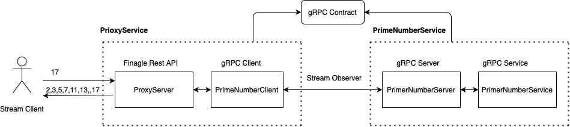

# Prime Number Platform 

The Prime number platform is a Microservice platform formed by two JVM services, and one gRPC library which contain the
contract of the communication between them.

The communication between them are made by RPC(Remote Produce Call) by [gRPC](https://grpc.io)

The documentation in detail of each service, it can be found here:

* [gRPC contract](gRpc-contract/README.md)
* [Proxy service](proxy-service/README.md)
* [Prime number service](prime-number-service/README.md)
* [Test framework](test-framework/README.md)

## Testing

**To go fast you have to go well** this quote of Robert C. Martin express perfectly what TDD and BDD is about. You should think first in all corner cases of your program, and then implement
one by one committing every scenario to have a quick feedback about your program.

In my application I invested around 70% of the time implementing the test framework, the type of testing implemented are described below.

* **Unit**: I used [scalatest](https://www.scalatest.org) together with some local mocks to Mock external resources of your class.
* **Integration**:
  Just to be clear, the Integration test are just a proof that our Unit test are well designed and the Mock behaves as I expect. None IT test should ever fail. And if it does,
  you have to reproduce it in Unit test.
* **Performance**: Performance/Stress test are meant to be used to detect possible concurrency issue in your application,
  and also to have a control of the latency of your endpoints.
  
## Stack

  
